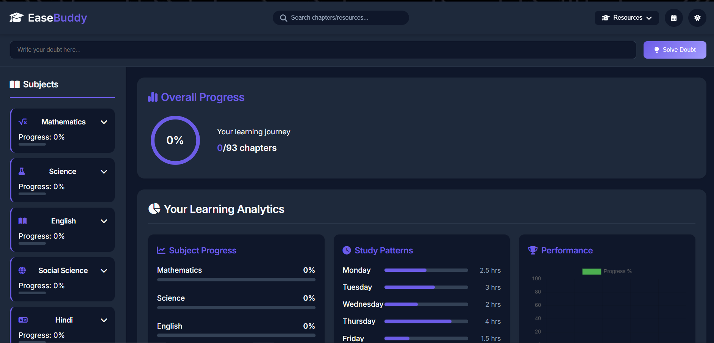
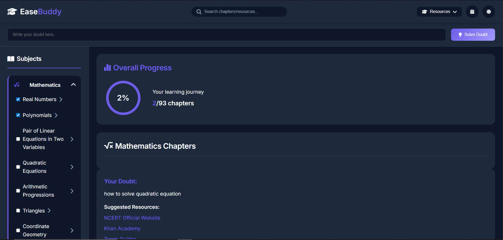

# EaseBuddy 🎓📚

**EaseBuddy** is a simple and powerful EdTech web app designed to help students easily find curated study resources — including YouTube playlists, PYQs (Previous Year Questions), study materials, and quick tests — organized by class, subject, and chapter.

> 🚀 Live: [https://tiny-duckanoo-6a7f80.netlify.app](https://tiny-duckanoo-6a7f80.netlify.app)

---

## ✨ Features

- 📘 Class-wise subject and chapter selection
- 📺 Curated YouTube playlists
- 📄 Study materials and important notes
- 📝 Previous Year Questions (PYQs)
- ✅ Quick test links (MCQs and concept check)
- 📊 Overall progress indication
- 🌙 Dark mode design (professional feel)

---

## 🛠️ Tech Stack

- **HTML**
- **CSS**
- **JavaScript (Vanilla)**

---

## 📁 Folder Structure

EaseBuddy/

- index.html       # Main HTML file
- styles.css       # Styling for the UI
- script.js        # Handles dynamic subject/chapter logic
- README.md        # Project info

---

## 🚧 Future Improvements

- 🔐 Login & Signup system
- 🎯 Progress tracking with badges
- 🤖 AI-powered Q&A assistant
- 📈 Analytics for parents/teachers
- 🌓 Night/Focus modes
- 🏆 Chapter completion rewards

---

## 📸 Screenshots

### Homepage

### Subject Selection

## 🙌 Author

**Hemant Saini**  
📫 [hemantsaini30](https://github.com/hemantsaini30)

---
